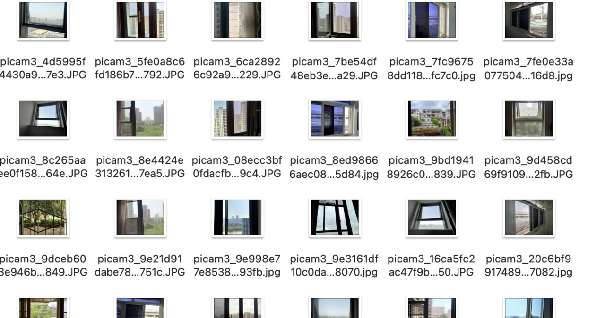

# An Intelligent Detection System for Window Opening and Closing Based on Deep Learning Techniques

xinmingFeng

Github: https://github.com/xinming-Feng/casa0018/tree/main/Assessment

Edge Impulse: https://studio.edgeimpulse.com/public/672207/live

## Introduction

This project introduces a vision-based system to detect whether a window is open or closed. A red LED lights up when the window is open, while a green LED indicates it is closed. Although camera-based window state detection is rare, related studies using depth cameras for door detection (Ramôa et al., 2020) provide useful insights.

Unclosed windows can cause various daily inconveniences, such as noise disturbances, insect intrusion, or rain entering the room. This system offers a practical solution by providing visual feedback, helping users manage window status more effectively in everyday life.

## Research Question

The central problem this study seeks to address is the automatic recognition of whether a window has been properly closed. In my daily life, I frequently forget to close windows during the day, only to be awakened in the middle of the night by the disruptive sound of passing vehicles. This recurring issue has caused considerable discomfort and has motivated the development of a reliable system to monitor window status in a timely and intelligent manner.

## Application Overview
The development of this project begins with the collection of a dedicated dataset, as it is fundamentally a vision-based recognition system reliant on camera input. Accordingly, images serve as the primary input for the dataset. Once the dataset is established, the overall deep learning framework is outlined. After data preprocessing, an appropriate classification model is selected along with the output strategy—this project formulates the task as a binary classification problem, identifying whether a window is "open" or "closed".

The process consists of several key stages, starting with data preprocessing, which involves preparing the images for effective feature extraction. Specific preprocessing steps include cropping images to uniform dimensions, optionally converting images to grayscale, and extracting relevant visual features.

Subsequently, the project proceeds to model training, in which the chosen model is trained on a designated training set and validated on a separate validation set to fine-tune the model parameters. For this project, a Convolutional Neural Network (CNN) is adopted due to its strong performance and learning capabilities in computer vision applications.

Following the training phase, the model's true performance is evaluated on a test set to determine its final classification accuracy. Once satisfactory performance is achieved, the model is deployed onto hardware for real-world testing.

Hardware Components Used:

- Raspberry Pi 4B

- Raspberry Pi Camera Module 3

- Two LED indicators (Red and Green)

The overall project workflow is illustrated in the following process diagram:

    

## Data

The dataset used in this project was self-collected to ensure diversity in the input features. A total of 228 images were gathered, encompassing 35 distinct window samples, with each window photographed in both open and closed states from various angles. To increase the robustness of the model, images were collected under different lighting conditions, including daytime, dusk, and nighttime.

The majority of these images were captured by friends and classmates upon request. However, the final deployment environment relies on the Raspberry Pi Camera Module 3, which differs from the devices used during the initial data collection. To address this discrepancy, a Python script named camera.py was developed to preprocess the original dataset and simulate the imaging characteristics of the Raspberry Pi Camera Module 3. The script adjusted key image parameters such as exposure and sharpness, and performed preliminary cropping to standardize all images to the same dimensions.

This preprocessing step ensured that the training data more closely resembled the images captured by the actual deployment hardware, thereby enhancing the model’s generalization and applicability to real-world conditions.

    

The original dataset of 228 images was too small, leading to overfitting during training. To address this, a Python script (extend.py) was used to augment the data by rotating images, generating 2–3 variants per original image. This increased the dataset size to 534 images, improving model generalization and performance.

    

After data expansion, the model will no longer be overfitted. Meanwhile, I attempted to process the data into grayscale images for model training and compared the training results with those of RGB images.

## Model

The core model used in this project is a Convolutional Neural Network (CNN), chosen for its proven strength in image-based classification tasks. Throughout development, the model architecture was gradually refined to meet the specific needs of the project. These refinements included adjusting the number and configuration of convolutional and pooling layers, as well as experimenting with the positioning of dense layers around the dropout layer to enhance both generalization and learning capacity. This iterative process helped improve model performance while maintaining a balance between complexity and overfitting.

After multiple rounds of experimentation and performance evaluation, the final and most effective architecture was determined as follows:

* Input Layer → 2D Convolution + Pooling Layer → Flatten → Dropout → Dense → Output Layer *

This configuration yielded the best results on the test set, achieving a maximum classification accuracy of 71.56%. The balance between model complexity and overfitting was carefully managed, and this architecture proved to be the most robust given the dataset and the binary classification task at hand.

    

The decision to adopt a Convolutional Neural Network (CNN) as the core model architecture was driven by the nature of the project—a camera-based computer vision application. CNNs are particularly well-suited for image analysis tasks due to their ability to extract local features through the application of convolutional kernels that slide across the input image. This mechanism is highly effective at capturing important visual characteristics such as edges, textures, and localized patterns, which are crucial for distinguishing between open and closed window states.

Furthermore, CNNs are known for their robustness in handling variations in visual input. Common image transformations such as translation, rotation, or scaling typically introduce minimal disruption to CNN performance, making the architecture especially appropriate for deployment on embedded hardware like the Raspberry Pi Camera Module, where the captured images may vary in angle or lighting conditions.

In addition to CNN, transfer learning was explored as an alternative approach. Specifically, the MobileNetV1 (96x96, width multiplier 0.25) model was selected due to its lightweight nature and efficiency in mobile vision applications. However, experimental results showed that its performance was suboptimal for this task: the test accuracy remained around 50%, which is insufficient for a binary classification problem and indicates limited learning capability on this dataset.

    

## Experiments
First of all, I used the default model of CNN as the baseline of my project. The specific results are as follows:

<table>
<tr>
<td></td>
<td></td>
</tr>
</table>

The initial model performed poorly, with a test accuracy of only 44.95%, and evaluation metrics such as ROC curve and recall were also unsatisfactory. Training and validation losses showed signs of overfitting, as the training loss dropped quickly while the validation loss remained high.

To address this, the architecture was simplified by reducing the convolutional layers from two to one. A Dense layer was also added after the Dropout layer to enhance feature representation. These adjustments improved the test accuracy to 57.01%, showing a notable performance gain.

Interestingly, RGB images consistently outperformed grayscale images, suggesting that color information is important for this classification task—likely due to environmental and visual cues present in color images.

After adjusting the model architecture, I adjusted the epoch, learning rate, batch size, dropout, Dense layer activation function, etc. The control variable method is used here.

| Epochs | Test Accuracy |
|:------:|:------------:|
| 10     | 46.50%       |
| 20     | 57.01%       |
| 30     | 51.04%       |

| Learning Rate | Test Accuracy |
|:------------:|:------------:|
| 0.0005       | 57.01%       |
| 0.0065       | 53.21%       |
| 0.001        | 50.46%       |

| Batch Size | Test Accuracy |
|:----------:|:------------:|
| 16         | 48.52%       |
| 32         | 57.01%       |
| 64         | 53.21%       |

| Dropout Rate | Test Accuracy |
|:-----------:|:------------:|
| 0.5         | 57.01%       |
| 0.6         | 53.21%       |
| 0.65        | 53.27%       |

| Activation Function | Test Accuracy |
|:-----------------:|:------------:|
| Softmax           | 57.01%       |
| Sigmoid           | 67.89%       |

I found that after replacing the activation function of the Dense layer, the accuracy of the model has been significantly improved. However, it is found from the loss variation trend of the model validation set that there is still a slight overfitting problem in the model. So in the end, I added Model.add (BatchNormalization()) to standardize the output of each layer, thereby accelerating the convergence of the model and improving the training stability. The final result is as follows:

<table>
<tr>
<td></td>
<td></td>
</tr>
</table>

The accuracy rate of the test set reached 71.56%. Meanwhile, it can be observed that parameters such as roc curve and recall have significantly improved compared to the baseline, indicating that the model performance is also very good.

## Results and Observations
After training, the final model was converted to TensorFlow Lite (float32) format and deployed onto a Raspberry Pi device. A custom script (script.py) was developed to run inference in real time, with the Raspberry Pi connected to two external LED indicators—one red and one green.

The model outputs two probability values between 0 and 1, corresponding to the likelihood of the window being in an open or closed state. By comparing these probabilities, the system determines the current state of the window:

- If the probability of "open" is higher, the red LED is activated.

- If the probability of "closed" is higher, the green LED lights up.

This setup enables real-time, visual feedback on window status and serves as a practical proof of concept for the deployment of deep learning models on low-power embedded systems.

    

In real-world tests, the model accurately identified window states in most environments, achieving around 70% accuracy. However, performance dropped with camera movement or visual obstructions like curtains, causing unstable or incorrect outputs. Despite these issues, the system remains practical for everyday use.

If more time and resources were available, several improvements would be prioritized:

1. Dataset Expansion and Diversity:

During data collection, it was noted that certain window types, such as those with mesh screens (e.g., insect screens) or semi-transparent drapes, were not well recognized. When a window was open but the mesh was closed, the model frequently misclassified the state as "closed." To improve robustness, the dataset should include more complex and diverse scenarios, particularly those involving partially obstructed views.

2. Feature Representation:

Current feature extraction relies heavily on visible cues such as window frames and handles. Given that glass is transparent, this approach limits recognition accuracy. In future iterations, incorporating depth features—such as those derived from stereo imaging or depth cameras—could allow the model to better infer spatial structures and object distances, which are especially valuable for recognizing transparent or semi-transparent surfaces.

3.. Hardware and User Interface Enhancements:

Future deployments could include additional components, such as an LCD display for more detailed feedback or auditory alerts to enhance user awareness. These improvements would make the system more user-friendly and practical for daily use.

## Bibliography

1. Ramôa, J.G., Alexandre, L.A. & Mogo, S. (2020) 'Real-Time 3D Door Detection and Classification on a Low-Power Device', Proceedings of the 20th IEEE International Conference on Autonomous Robot Systems and Competitions (ICARSC 2020), Ponta Delgada, Azores, Portugal, April 2020, pp. 96–101. https://www.di.ubi.pt/~lfbaa/pubs/icarsc2020.pdf ​

----

## Declaration of Authorship

I, AUTHORS NAME HERE, confirm that the work presented in this assessment is my own. Where information has been derived from other sources, I confirm that this has been indicated in the work.

*Xinming Feng*

2025.04.24

Word count: 1450

I admit that I used Chat-GPT(ChatGPT-4.5,OpenAI,https://chatgpt.com) to help me with report translation and grammar and typos correction.
